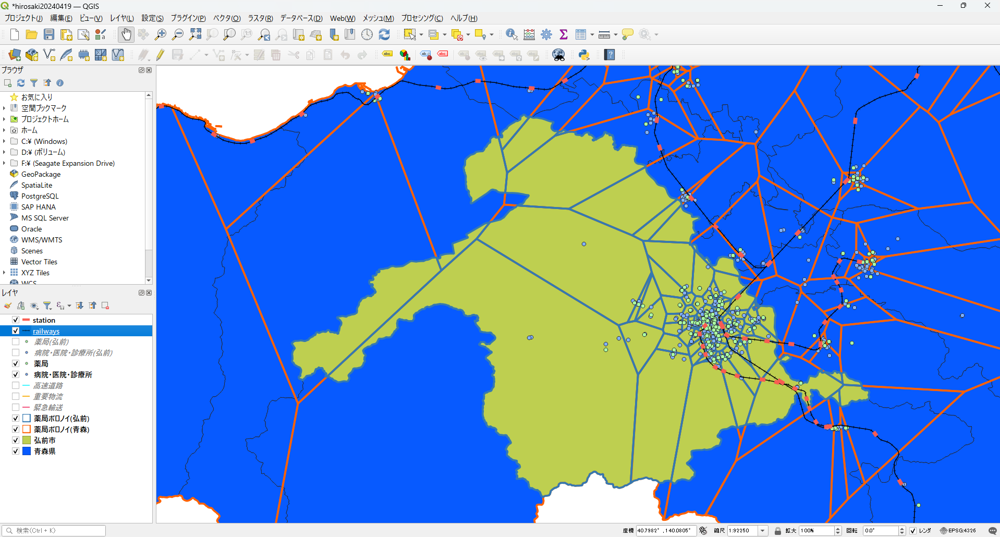

# SYLPHIDE
### Spatial Yield Line Photogenic Higher Intentions Dodging Enrollment
### 厚生局の保険医療機関・保険薬局の指定等一覧及び保険医・保険薬剤師の新規登録一覧をリスト化する
シルフィードとコッペリアはマジで理解できない．ただ妖精を追いかけていったヤツと人形好きを暴露された哀れな中年男性の悲哀のどこで感動するんだよという感じ…

とりあえず医療機関としての病院・診療所・歯科は[国土数値情報](https://nlftp.mlit.go.jp/)に公開されているのだけど，MHLWさんは内部の統率が取れてない感が凄いですね．
まぁ，お座りができるゴリラと玉乗りができる犬に，レクサスより高いカスタムをしたアルファード運転させて，後ろでウサギが麻雀しながら人間が箱乗りしてる連中相手なので，それは仕方ないと思います．
諸々を察して，調剤薬局の位置情報・住所情報・郵便番号・電話番号の一覧に関して，こちらで予め気を利かせておきました．

#### データ取得元
- 北海道厚生局
https://kouseikyoku.mhlw.go.jp/hokkaido/gyomu/gyomu/hoken_kikan/code_ichiran.html
- 東北厚生局
https://kouseikyoku.mhlw.go.jp/tohoku/gyomu/gyomu/hoken_kikan/itiran.html
- 関東信越厚生局
https://kouseikyoku.mhlw.go.jp/kantoshinetsu/chousa/shitei.html
- 東海北陸厚生局
https://kouseikyoku.mhlw.go.jp/tokaihokuriku/newpage_00287.html
- 近畿厚生局
https://kouseikyoku.mhlw.go.jp/kinki/tyousa/shinkishitei.html
- 中国四国厚生局
https://kouseikyoku.mhlw.go.jp/chugokushikoku/chousaka/iryoukikanshitei.html
- 四国厚生局
https://kouseikyoku.mhlw.go.jp/shikoku/gyomu/gyomu/hoken_kikan/shitei/index.html
- 九州厚生局
https://kouseikyoku.mhlw.go.jp/kyushu/gyomu/gyomu/hoken_kikan/index_00006.html

### Photo
- act-2

#### 手順

1. 全ての都道府県ごとの薬局リストを取得し，xlsxsとしたxlsxを一つのディレクトリに配備する
2. Rにてpharmacies_clean.Rで一つのCSVファイル化及び必要なカラムの抽出を行う
3. pythonにて空白セルを含む行を削除する
4. Rにて薬局コード(micode)の不要な記号を削除する
5. [giselle](https://github.com/geojackass/giselle)でジオコーディングを行う  
(6). [郵便番号](https://www.post.japanpost.jp/zipcode/download.html)が必要な場合，こちらを参照してください．
License
=======
### Released under the MIT license
##### Copyright (c) 2024 Shoichi Otomo [@geojackass](https://geojackass.com/)

- read under the MIT LICENSE  
[Open Source Initiative](http://opensource.org/licenses/mit-license.php)  

Permission is hereby granted, free of charge, to any person obtaining a copy of this software and associated documentation files (the "Software"), to deal in the Software without restriction, including without limitation the rights to use, copy, modify, merge, publish, distribute, sublicense, and/or sell copies of the Software, and to permit persons to whom the Software is furnished to do so, subject to the following conditions:  

The above copyright notice and this permission notice shall be included in all copies or substantial portions of the Software.  

THE SOFTWARE IS PROVIDED "AS IS", WITHOUT WARRANTY OF ANY KIND, EXPRESS OR IMPLIED, INCLUDING BUT NOT LIMITED TO THE WARRANTIES OF MERCHANTABILITY, FITNESS FOR A PARTICULAR PURPOSE AND NONINFRINGEMENT. IN NO EVENT SHALL THE AUTHORS OR COPYRIGHT HOLDERS BE LIABLE FOR ANY CLAIM, DAMAGES OR OTHER LIABILITY, WHETHER IN AN ACTION OF CONTRACT, TORT OR OTHERWISE, ARISING FROM, OUT OF OR IN CONNECTION WITH THE SOFTWARE OR THE USE OR OTHER DEALINGS IN THE SOFTWARE.
